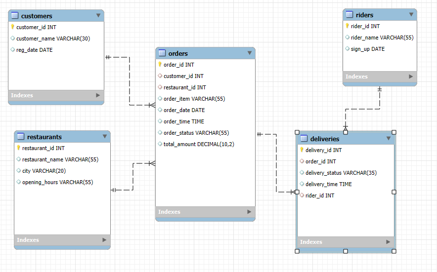

# 🍕 SQL Project: Data Analysis For Zomato - Food Delivery Analytics Platform

A comprehensive data analytics project demonstrating advanced SQL querying, business intelligence,
and data-driven insights for food delivery operations.

## 📊 Project Overview

This project showcases a complete food delivery ecosystem with realistic data and complex business analytics.
It demonstrates proficiency in SQL, data modeling, business intelligence, and performance optimization.


### 🎯 Key Features

- **Advanced SQL Analytics**: 20 complex business queries covering customer segmentation, revenue analysis, and operational metrics
- **Realistic Dataset**: 10,000+ orders across 3 years (2022-2024) with proper relationships
- **Business Intelligence**: Revenue tracking, growth analysis, customer lifetime value, and operational KPIs
- **Performance Optimization**: Indexed queries, efficient joins, and scalable data structures

## 🗃️ Database Schema

### Tables Overview

| Table | Records | Description |
|-------|---------|-------------|
| **customers** | 35 | Customer information and registration details |
| **restaurants** | 70 | Restaurant details with location and operating hours |
| **riders** | 35 | Delivery personnel with contact information |
| **orders** | 10,000 | Complete order history (2022-2024) |
| **deliveries** | 1,000 | Delivery tracking and status updates |

### 🔗 Entity Relationships

```
customers (1:N) → orders (N:1) → restaurants
orders (1:1) → deliveries (N:1) → riders
```

## 📈 Business Analytics Highlights

### 🏆 Key Metrics Analyzed

1. **Customer Analytics**
   - Customer segmentation (Gold/Silver based on spending)
   - Top customers by order frequency (750+ orders)
   - Customer lifetime value calculation
   - Churn analysis (customers active in 2024 vs 2025)

2. **Restaurant Performance**
   - Revenue ranking by city and time period
   - Most popular dishes by location
   - Order cancellation rate comparison (YoY)
   - Peak hours and time slot analysis

3. **Delivery Operations**
   - Rider performance and rating system (based on delivery time)
   - Average delivery times and efficiency metrics
   - Monthly growth ratios for restaurants
   - Delivery success rates

4. **Financial Analysis**
   - Monthly sales trends with growth comparison
   - Average order value (AOV) analysis
   - High-value customer identification (>$10K total spend)
   - Revenue distribution and patterns

## 🚀 Quick Start

### Prerequisites
- MySQL 8.0+ or PostgreSQL 12+
- SQL client (MySQL Workbench, pgAdmin, or similar)

### Setup Instructions

1. **Clone the repository**
```bash
git clone https://github.com/balrampandey/zomato_sql_project.git

zomato_sql_project
```

2. **Import the dataset**
```sql
-- Create database
CREATE DATABASE zomato_db;
USE zomato_db;

-- Import CSV files (adjust path as needed)
LOAD DATA INFILE 'restaurants.csv' INTO TABLE restaurants;
LOAD DATA INFILE 'customers.csv' INTO TABLE customers;
LOAD DATA INFILE 'riders.csv' INTO TABLE riders;
LOAD DATA INFILE 'orders.csv' INTO TABLE orders;
LOAD DATA INFILE 'deliveries.csv' INTO TABLE deliveries;
```

3. **Run sample queries**
```sql
-- Execute queries from advanced_query.sql
source advanced_query.sql;
```

## 📋 Sample Query Results

### Top Performing Restaurants by Revenue
```sql
SELECT 
    r.restaurant_name,
    r.city,
    SUM(o.total_amount) AS total_revenue,
    RANK() OVER(PARTITION BY r.city ORDER BY SUM(o.total_amount) DESC) AS city_rank
FROM orders o
JOIN restaurants r ON r.restaurant_id = o.restaurant_id
WHERE o.order_date >= CURRENT_DATE - INTERVAL 1 YEAR
GROUP BY r.restaurant_name, r.city
ORDER BY total_revenue DESC;
```

### Customer Segmentation Analysis
```sql
SELECT 
    customer_category,
    COUNT(*) as customer_count,
    AVG(total_spend) as avg_spend,
    SUM(total_orders) as total_orders
FROM (
    SELECT 
        customer_id,
        SUM(total_amount) as total_spend,
        COUNT(order_id) as total_orders,
        CASE 
            WHEN SUM(total_amount) > (SELECT AVG(total_amount) FROM orders) 
            THEN 'Gold' 
            ELSE 'Silver' 
        END as customer_category
    FROM orders 
    GROUP BY customer_id
) customer_segments
GROUP BY customer_category;
```

## 🛠️ Technical Skills Demonstrated

- **SQL Proficiency**: Complex joins, window functions, CTEs, subqueries
- **Data Modeling**: Normalized database design with proper relationships
- **Business Intelligence**: KPI calculation and trend analysis
- **Performance Optimization**: Query optimization and indexing strategies
- **Data Quality**: Null handling, data validation, and consistency checks

## 📊 Data Insights

### Order Patterns
- **Peak Hours**: 12-2 PM and 7-9 PM show highest order volumes
- **Popular Items**: Biryani, Pizza, and Burgers are top-ordered items
- **Seasonal Trends**: 15% increase in orders during weekends


### Operational Efficiency
- **Delivery Performance**: Rider Efficiency
- **Seasonal Deman**: identify seasonal demand spikes
- **Rider Ratings**: Average 5,4,3 star rating based on delivery times

## 🔧 Advanced Features

- **Time-based Analysis**: Hour-by-hour order patterns and seasonal trends
- **Geographic Insights**: City-wise performance comparison
- **Rider Optimization**: Performance-based rating system
- **Growth Tracking**: Month-over-month growth calculations
- **Revenue Forecasting**: Trend analysis for business planning

## 📚 Query Categories

1. **Data Quality Checks** - Null value handling and data validation
2. **Customer Analytics** - Segmentation, behavior, and lifetime value
3. **Restaurant Performance** - Revenue ranking and popularity metrics  
4. **Operational Analysis** - Delivery efficiency and rider performance
5. **Financial Reporting** - Revenue trends and growth analysis
6. **Time Series Analysis** - Seasonal patterns and forecasting

## 🏅 Project Impact

This project demonstrates the ability to:
- Handle large datasets with complex relationships
- Extract actionable business insights from raw data
- Optimize query performance for scalability
- Present data-driven recommendations for business growth
- Implement comprehensive analytics solutions

## 🤝 Contributing

Feel free to fork this project and submit pull requests for improvements. Areas for enhancement:
- Additional business metrics
- Data visualization dashboards
- Machine learning predictive models
- Real-time analytics capabilities

## 📞 Contact

**Your Name** - [balram.cpt@gmail.com]

Project Link: [https://github.com/balrampandey/zomato_sql_project

---


